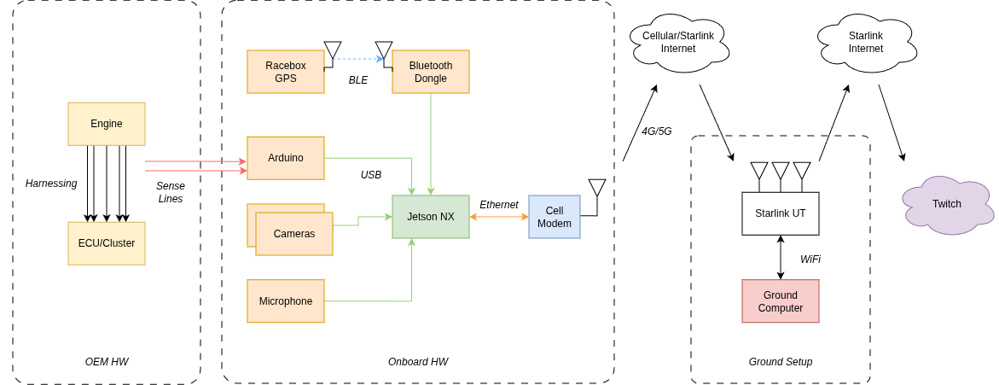
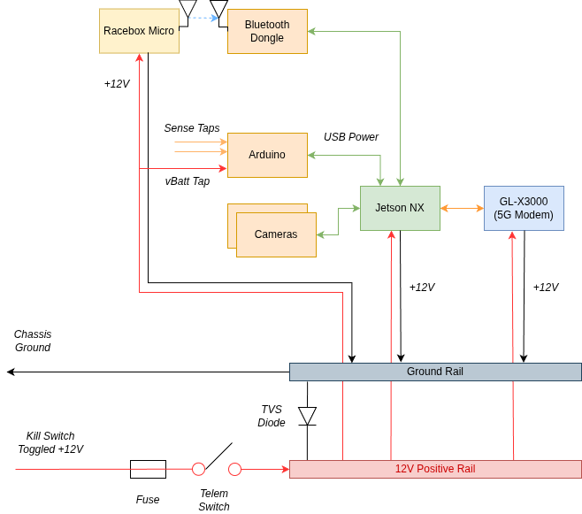

# Telem

This is a project to build out a telemetry system, specifically on a 1992 Honda Accord for a realtime dashboard and spectator livestream.

We use a combination of analog engine taps, GPS, and cameras streaming data back to a Jetson Nano through a 5G Modem, back to home base where a ground computer exposes all the data via a custom web dashboard.


## HW Architecture



## Dataflow

```
┌──────────────┐  ┌──────────────┐  ┌──────────────┐
│ Arduino Mega │  │ RaceBox      │  │ Camera1      │
│ ECT TPS MAP  │  │ Micro        │  │ Camera2      │
│ Brake Vbatt  │  │ GPS/IMU      │  │ Microphone   │
│ RPM VSS      │  │ 25Hz         │  └──────┬───────┘
└──────┬───────┘  └──────┬───────┘         │
       │ serial 115200   │ BLE             │ USB
       ▼                 ▼                 ▼
┌─────────────────────────────────────────────┐
│              Jetson Orin NX                 │
│                                             │
│  serial-bridge ──┐                          │
│                  ├──► telem-server          │
│  racebox-bridge ─┘    (WAL engine)          │
│                          │                  │
│  video-streaming      HTTP :4400            │
│  (GStreamer/SRT)      SSE /stream           │
│  cam1 :9000           msgpack /wal/range    │
│  cam2 :9001                                 │
│  audio :9002                                │
└──────────────────────┬──────────────────────┘
                       │ Ethernet
                       ▼
                ┌──────────────┐
                │  Cell Modem  │
                │  GL-X3000    │
                └──────┬───────┘
                       │ 4G/5G · Starlink · Tailscale
                       ▼
┌─────────────────────────────────────────────┐
│  Ground Computer(s)                         │
│                                             │
│  ┌────────────┐      ┌──────────────────┐   │
│  │  Browser   │      │ OBS Studio       │   │
│  │  (Vite)    │      │  SRT ingest      │   │
│  │            │      │  cam1/cam2 audio │   │
│  │ Dashboard  │      │  Browser src     │   │
│  │ Review     │      │  overlays        │   │
│  │ Debug      │      └────────┬─────────┘   │
│  │ Editor     │               │             │
│  └────────────┘               │             │
└───────────────────────────────┼─────────────┘
                                │ RTMP
                                ▼
                          ┌──────────┐
                          │  Twitch  │
                          └──────────┘
```

## Directory Structure

```
src/              Arduino Mega firmware (PlatformIO)
server/           Node.js telemetry server + WAL engine
  src/            Core: wal.ts, http.ts, sessions.ts, lap-detector.ts, gear.ts, sensors.ts
  scripts/        serial-bridge.ts, gen-data.ts, compact.ts, repair-sessions.ts
client/           Vite multi-page web app
  src/            TypeScript sources for each page
bluetooth/        RaceBox BLE bridge (node-ble, UBX protocol)
streaming/        GStreamer video/audio capture scripts
tracks/           Track geometry JSON files (Sonoma, Sharon, etc.)
fonts/            Berkeley Mono
```

# Hardware Design

## Hardware BOM

| Component | Model | Specs | Power | Cost | Category | Notes |
|---|---|---|---|---|---|---|
| Forward Wide Camera | [Logitech C920x](https://www.amazon.com/Logitech-C920x-Pro-HD-Webcam/dp/B085TFF7M1) | 1080p × 30fps | USB 2.5W | $70 | Video | Driver POV |
| Driver Camera | [Logitech C920x](https://www.amazon.com/Logitech-C920x-Pro-HD-Webcam/dp/B085TFF7M1) | 1080p × 30fps | USB 2.5W | $70 | Video | Shifting and pedal movements |
| On Board Compute | [Jetson Orin NX](https://www.amazon.com/seeed-studio-reComputer-J4012-Edge-Pre-Installed/dp/B0C88V4CB7/) | 16GB RAM, NVENC accelerator | 12V/5A → 60W max | $1150 | Compute | Hardware encoding accelerator avoids video bottleneck |
| 5G Modem | [GL-X3000](https://www.amazon.com/GL-iNet-GL-X3000-Multi-WAN-Detachable-WireGuard/dp/B0C5RCQ8N5) | 5G, physical SIM | 12V/2.5A → 30W max | $323 | Connectivity | |
| SIM Card + Plan | [Visible+ Pro](https://www.visible.com/plans) | Unlimited data | — | $45/mo | Connectivity | Verizon works well at Thunderhill and Sonoma |
| GPS/Accel | [RaceBox Micro](https://www.amazon.com/RACEBOX-Micro-25Hz-GPS-Accelerometer/dp/B0DF5PX5X9/) | 25Hz, <1m accuracy | 12V, 0.2W max | $125 | Telemetry | Also works as standalone product with phone |
| Bluetooth Dongle | [UD100-G03](https://www.amazon.com/dp/B0161B5ATM) | BLE 4.0 | USB, 2.5W max | $39 | Telemetry | Jetson lacks built-in BT; needed for RaceBox BLE |
| Microcontroller | [Arduino Mega 2560](https://www.amazon.com/Arduino-ATmega2560-Compatible-Advanced-Projects/dp/B0046AMGW0/) | 54 digital I/O, 16 analog inputs | USB, 1W max | $49 | Telemetry | Overkill; smaller 5V Arduino would suffice |
| Microphone | [LavMicro-U](https://www.amazon.com/Saramonic-Professional-Microphone-Interviews-LAVMICRO-U/dp/B09V9NVL4Q/) | USB lavalier | USB, 0.5W | $30 | Audio | In-car audio, Opus 64kbps |

### Design Considerations
We had considered a Starlink Mini as vehicle data offload but decided against this because I was unsure if we would be in a garage. The line-of-sight requirements are tough.

We has also considered running the stream on the vehicle, but this would have been very rough as the stream would have died if the telemetry computer restarted. So keeping that separate was a great choice.

## Telemetry Points

| Telemetry Point | Sense Strategy | Signal Type | Arduino Pin | Sense Line |
|---|---|---|---|---|
| Video 1 | Camera | USB | — | — |
| Video 2 | Camera | USB | — | — |
| Car Audio | Microphone | USB | — | — |
| Brake Indicator | Binary yes/no voltage | 12V divided down 4.3× | A5 | White/Green brake light line |
| Battery Voltage | Analog | 12V divided down 4.3× | A6 | Tap off PDB +12V bus |
| Throttle Position | Calibrated 0–100% | 5V analog | A9 | D11 ECU D connector |
| Engine Coolant Temp | Lookup table | 5V analog | A8 | D13 ECU D connector |
| MAP | Lookup table | 5V analog | A10 | D13 ECU D connector |
| RPM (Tach) | Instantaneous pulses/sec | 12V square wave, stepped down to 5V | D18 | A7 BLU Dash connector |
| VSS | Instantaneous pulses/sec | 12V square wave, stepped down to 5V | D19 | B10 ECU B connector |
| GPS | RaceBox | Digital | — | — |
| Accel | RaceBox | Digital | — | — |
| Gyro | RaceBox | Digital | — | — |

### Tapping Strategy

Since the 1992 Honda Accord is before the OBD2 era, we needed to grab most of our telemetry points via analog sense taps. For 12V signals, this would require a voltage divider circuit. For 5V signals, as long as we use a 5V micro controller we can skip the voltage divider.

#### Details of Tapping

Direct sense taps require a high impedance resistor in line to prevent the Arduino ESD protection diodes (when arduino is unpowered) from pulling the sense lines low and confusing the ECU. Especially if MAP is pulled low, the car will not start.

The RPM line comes from the ignition which has a lot of noise, and can separately also spike as high as 24V or 36V. I have a diode to suppress the voltage spikes, but next time I'll add a cap to suppress the noise.

To make the build complete, it is helpful to have:
- T Splice connectors
- Butt splice connectors
- Diodes, resistors, capacitors
- Physical switch
- Inline fuses and fuse holders

## Power Architecture



### Power Considerations

I had considered adding another secondary battery onboard, but descoped it at the time to make deadlines. The primary goal was to power as much as we could off the onboard battery to keep things simple.

At the race, we noticed two significant downsides:
- You can deplete the vehicle battery while running telemetry which means we had to repeatedly hook up a battery charger while running telem only
- Cranking the starter brings the `+12V rail below +10V` which browns out the computers. This meant stalling the car and restarting the car would necessitate a power cycle, very annoying.

For the next iteration we plan to add a small auxiliary battery with:
- a relay that switches off if the kill switch is switched to cut power to telemetry
- diodes that prevent auxiliary battery from flowing to the `main electrical bus`
</details>

## Driver Communication

We ran driver communication completely parallel to telemtry. We would communicate with drivers via `discord` audio call. This meant that if the `telemetry` stack restarted, our `audio` communications persisted. This was very useful during `hotpits` when we shut off telemetry, or if we ever had to crank the starter on track.

# Software

## WAL Engine

Custom append-only write-ahead log designed for low memory usage on the Jetson.

- **Disk format**: NDJSON with merged channels per line: `{"seq":1,"ts":...,"d":{"rpm":3500,"speed":65}}`
- **Per-batch seq**: One sequence number per ingest call (not per channel)
- **File rotation**: 5,000 ticks per file (~200s of data), range footer on each file (`#range:min,max`)
- **In-memory index**: `{file, minSeq, maxSeq}[]` built on startup for fast range queries
- **Ring buffers**: Per-channel in-memory (6,000 entries) for live SSE streaming
- **Compaction**: Merges same-timestamp lines within 50ms buckets, reassigns sequential seqs, repairs session pointers
- **Locking**: `wal.lock` file prevents concurrent servers and protects during compaction. Server returns 503 on WAL routes while compacting.
- **Wire format**: MessagePack via `msgpackr` (~40% smaller than JSON)

## Client Pages

| Page | Path | Purpose |
|---|---|---|
| Dashboard | `/` | Live gauges (speed/RPM/TPS/brake), GPS maps (follow + overview), g-force dial, diagnostics, lap times with pace delta |
| Review | `/review.html` | Session/lap browser, seekable replay, trail color modes (speed/throttle/RPM/brake), IndexedDB cache |
| Debug | `/debug.html` | Auto-discovered channels with sparklines, systemd service management, camera controls |
| Editor | `/editor.html` | Track polyline editor with Leaflet, toolbar modes, bearing slider, satellite toggle |
| Stream: Map | `/stream/map.html` | Transparent overlay — track + car position (for OBS) |
| Stream: Car Data | `/stream/car_data.html` | Transparent overlay — value + sparkline gauges |
| Stream: Lap Data | `/stream/lap_data.html` | Transparent overlay — driver, lap count, timer, delta |

## Video/Audio Streaming

GStreamer pipelines on the Jetson, SRT over Tailscale:

- **Video**: `v4l2src → jpegdec → nvvidconv → nvv4l2h264enc (4Mbps, GOP 15) → MPEG-TS → SRT`
- **Audio**: `alsasrc (40ms buffer) → Opus (64kbps, 10ms frames) → MPEG-TS → SRT`
- **SRT latency**: 100ms (tuned for ~150ms Tailscale RTT)
- C930e always pinned to port 9000 regardless of USB enumeration

## Lap Detection

GPS-based — no trackside hardware needed.

1. Project GPS position onto track centerline polyline → normalized progress 0–1
2. Detect finish line crossing: `prevProgress > 0.85 && currentProgress < 0.15`
3. First lap auto-flagged as out lap, session stop flags current lap as in lap
4. Pace delta: progress-vs-time curve from best lap, interpolated at current position


# Software Setup

On the Jetson:

```bash
# Install deps + systemd services
./setup.sh

# Check service status
./status.sh

# View logs
journalctl -u telem-server -u serial-bridge -u racebox-bridge -u video-streaming -f
```

### Services (on Jetson)

| Service | Description |
|---|---|
| `racebox-connect` | BLE connection to RaceBox Micro |
| `telem-server` | WAL telemetry server (port 4400) |
| `racebox-bridge` | RaceBox BLE → telem ingest |
| `serial-bridge` | Arduino Mega serial → telem ingest |
| `video-streaming` | GStreamer camera streams over SRT |

## Development

### Local Dashboard (laptop)

Start the server and client in two terminals:

```bash
# Terminal 1 — server
cd server && npx tsx src/main.ts

# Terminal 2 — client (Vite dev server, port 5173)
cd client && npm run dev
```

Open **http://localhost:5173** — the `?local=true` flag connects to `localhost:4400` instead of the Jetson's Tailscale address.

Add `?local=true` — to connect to local synthetic data.

### Other Commands

```bash
# Tests
cd server && npx vitest run

# Generate synthetic data
cd server && npx tsx scripts/gen-data.ts

# Compact WAL (run offline or delegates to server if running)
cd server && npx tsx scripts/compact.ts --data-dir ./data
```

## Embedded

```bash
# Upload Arduino Mega firmware
pio run -e mega_serial -t upload
```

### udev rules (for Arduino on Linux)

```bash
curl -fsSL https://raw.githubusercontent.com/platformio/platformio-core/develop/platformio/assets/system/99-platformio-udev.rules | sudo tee /etc/udev/rules.d/99-platformio-udev.rules
sudo service udev restart
```
